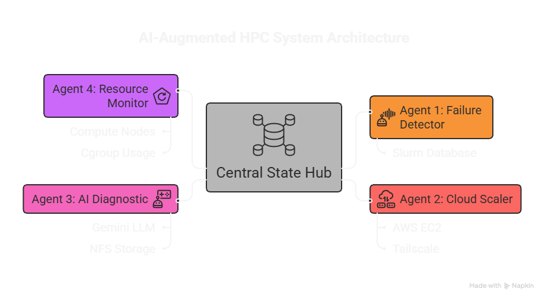
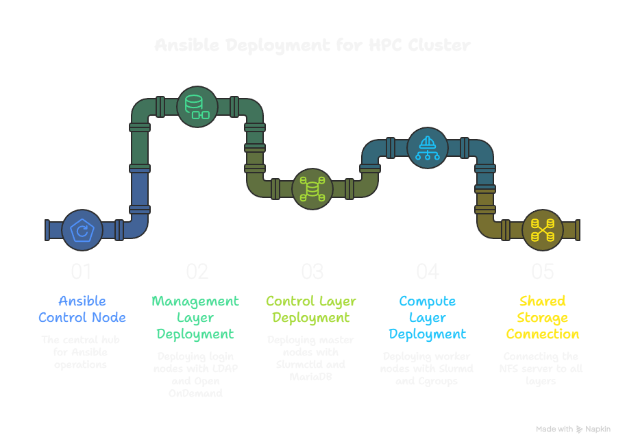
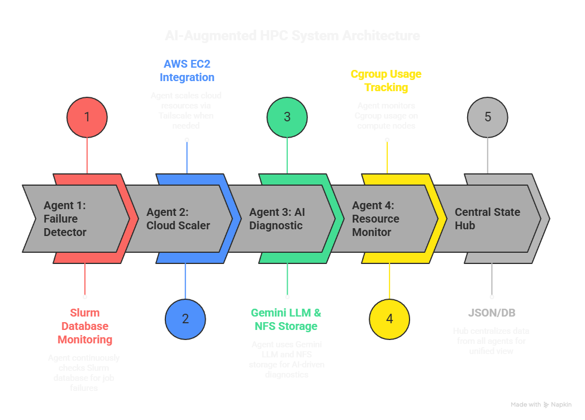

# AI-Augmented HPC Management: Autonomous Scaling and Intelligent Diagnostics

[](https://www.linkedin.com/in/mohit-pawaskar-ba5239331)

This project implements an intelligent, self-governing High-Performance Computing (HPC) management layer. It integrates **Ansible-driven automation** for infrastructure with **AI-powered Python agents** that monitor, scale, and diagnose Slurm cluster activities in real-time.

---

## Table of Contents
1. [Project Overview](#project-overview)
2. [Folder Structure & Purpose](#folder-structure--purpose)
3. [Infrastructure Layer (mas-hpc-ansible)](#infrastructure-layer-mas-hpc-ansible)
4. [Operational Intelligence Layer (mas-hpc-system)](#operational-intelligence-layer-mas-hpc-system)
5. [Documentation & Reports](#documentation--reports)
6. [Installation and Setup](#installation-and-setup)
7. [License](#license)

---

## Project Overview
Traditional HPC management often faces rigid resource allocation and high operational overhead from manual troubleshooting. This project introduces a paradigm shift by implementing a framework that perceives cluster states, diagnoses root causes of failures, and executes remedial actions autonomously using the **Gemini API**.



---

## Folder Structure & Purpose
The repository is organized into distinct functional units to separate base infrastructure from autonomous logic:

* **`mas-hpc-ansible/`**: The **Infrastructure Layer**. Contains playbooks and roles required to deploy the cluster foundation using Infrastructure as Code (IaC).
* **`mas-hpc-system/`**: The **Operational Intelligence Layer**. Houses the Python-based AI agents, monitoring tools, and hybrid-cloud scaling logic.
* **`docs/`**: Centralized repository for technical documentation, project reports, and presentations.
* **`images/`**: Stores architectural diagrams and workflow visualizations for documentation.

---

## Infrastructure Layer: mas-hpc-ansible
This component automates the deployment of a 5-node Slurm architecture, establishing the "nervous system" of the cluster.



### Key Roles & Configuration
* **`roles/common/`**: Sets up the base layer, including DNS for hostname resolution, NTP (Chrony) for sub-millisecond clock synchronization, and passwordless SSH.
* **`roles/identity/`**: Configures **OpenLDAP** for centralized identity management, ensuring consistent UID/GID assignment across the cluster.
* **`roles/storage/`**: Implements **NFS** and **LVM** for shared, elastic storage management across all nodes.
* **`roles/master/`**: Installs the Slurm controller (`slurmctld`) and the MariaDB-backed accounting database (`slurmdbd`).
* **`roles/compute/`**: Configures worker daemons (`slurmd`) and utilizes **Cgroups v2** for hardware-level resource enforcement.

---

## Operational Intelligence Layer: mas-hpc-system
This layer consists of specialized Python-based AI agents that communicate through a centralized state hub.



### The AI Agents
1.  **Agent 1 (Detector)**: Monitors cluster health and the Slurm accounting database to identify job failures or performance bottlenecks in real-time.
2.  **Agent 2 (Scaling Orchestrator)**: Manages autonomous cloud bursting via **AWS Boto3** and **Tailscale VPN** when local compute resources are exhausted.
3.  **Agent 3 (AI Diagnostic)**: Acts as the "AIOps" brain, utilizing the **Gemini API** to analyze system logs and convert cryptic errors into plain-English troubleshooting steps.
4.  **Agent 4 (Monitor)**: Tracks real-time telemetry and resource utilization trends to suggest scheduling optimizations.

---

## Documentation & Reports
Detailed technical deep-dives are available in the `docs/` folder:
* 📄 [Complete Project Report (PDF)](docs/Project_Report.pdf) – A 37-page comprehensive technical analysis of the system architecture and implementation.
* 📊 [Project Presentation (PPTX)](docs/Project_Presentation.pptx) – A visual summary of core operations, Slurm integration, and AI-driven results.

---

## Installation and Setup

### 1. Provision Infrastructure
Navigate to the ansible directory and configure your cluster hardware:

* **Update Inventory**: Open `mas-hpc-ansible/inventory.ini` and replace the placeholder IP addresses with your actual local cluster node IPs.
* **Set Global Variables**: Update `mas-hpc-ansible/group_vars/all.yml` with your specific network details, domain names, and administrative credentials.
* **Execute Deployment**: Run the playbook to automate the setup of all services across the 5 nodes:

```bash
cd mas-hpc-ansible
ansible-playbook site.yml
```

### 2. Launch AI Management System
Initialize the autonomous agents to start managing the cluster:

Configure Environment: Create a .env file in mas-hpc-system/ using the provided template and add your GEMINI_API_KEY, AWS credentials, and Tailscale keys.

Deploy Agent System: Run the startup script to launch all four agents as background processes:

```bash
cd mas-hpc-system
chmod +x start_system.sh
./start_system.sh
```

License
Copyright (c) 2026 Mohit Pawaskar and Team.

Permission is hereby granted, free of charge, to any person obtaining a copy of this software and associated documentation files (the "Software"), to deal in the Software without restriction, including without limitation the rights to use, copy, modify, merge, publish, distribute, sublicense, and/or sell copies of the Software, and to permit persons to whom the Software is furnished to do so, subject to the following conditions:

The above copyright notice and this permission notice shall be included in all copies or substantial portions of the Software.

THE SOFTWARE IS PROVIDED "AS IS", WITHOUT WARRANTY OF ANY KIND, EXPRESS OR IMPLIED, INCLUDING BUT NOT LIMITED TO THE WARRANTIES OF MERCHANTABILITY, FITNESS FOR A PARTICULAR PURPOSE AND NONINFRINGEMENT.